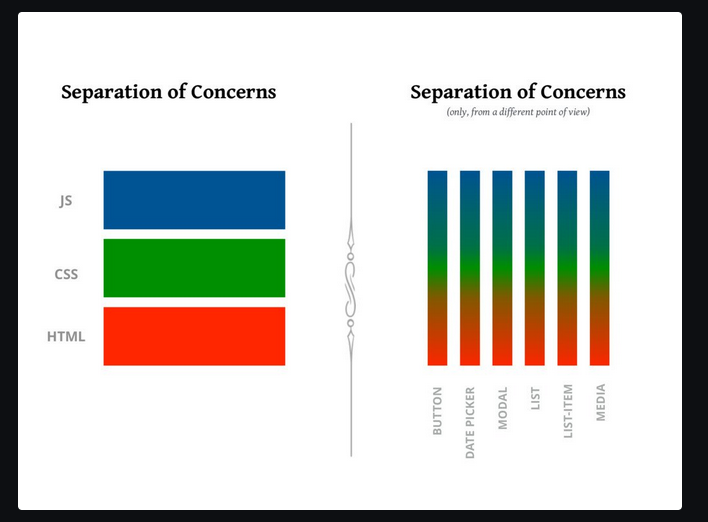
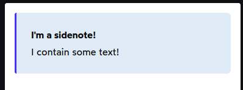

# Chap 11 | Styling in React

Anki => 11-styling-in-react

**Q1**:What is React way of styling ? 

**Answer**:



The core idea with components is that each componen is a bundle of markup(in JSX), logic (in JS) and styles (in CSS).Our component should own all the styles related to that component

---

**Q2**:What is Block Element Modfier and why is it used ? 

**Solution**:

- The traditional way of writing CSS involves writing lots of different
  selectors to target the same element. This leads to an "arms race",
  where every selector needs to be more and more aggressive, in order to
  override existing styles

- This has long been a frustration of writing CSS on large projects, and
  there have been many proposed solutions. One of the most popular is BEM
  (Block Element Modifier), a naming methodology.

- BEM does make CSS much easier to work with *if it's followed 100% of the time*.

**Q3**: What do styled-components , CSS modules , vanilla-extract,stitches etc do ? 

**Answer**:

- The traditional way of writing CSS involves writing lots of different
  selectors to target the same element. This leads to an "arms race",
  where every selector needs to be more and more aggressive, in order to
  override existing styles

- This has long been a frustration of writing CSS on large projects, and
  there have been many proposed solutions. One of the most popular is BEM
  (Block Element Modifier), a naming methodology.

- BEM does make CSS much easier to work with *if it's followed 100% of the time*.Unfortunately, human nature means that it's very easy to go off the
  rails, especially when it comes to large projects with many developers.
  It requires superhuman discipline to follow the methodology.

- When React grew to prominence, the community realized that there was an
  opportunity to improve things. In the years since, there have been many
  many different tools released, including styled-components, emotion,
  vanilla-extract, stitches, CSS Modules etc.

- These tools "bake in" the scoping, generating unique selectors for us automatically.

---

**Q4**:Modern Bundlers like Webpack support importing non-JS files like CSS modules ? (True/False)

**Solution**:

- Yes Modern Bundlers like Webpack support importing non-JS files like CSS modules

---

**Q5**:When our CSS file ends in a `.module.css` and we import it like a JS module what things happen during the transpilation process. Specifically talk about what happens to the CSS during transpilation 

App.js => 

```jsx
import Sidenote from './components/Sidenote';

function App() {
  return (
    <>
      <Sidenote title="I'm a sidenote!">
        I contain some text!
      </Sidenote>
    </>
  );
}

export default App
```

Sidenote.js => 

```js
import styles from './Sidenote.module.css';

function Sidenote({ title, children }) {
  return (
    <aside className={styles.wrapper}>
      <h3 className={styles.title}>{title}</h3>
      <p>{children}</p>
    </aside>
  );
}

export default Sidenote;
```

Sidenote.module.css => 

```css
.wrapper {
  padding: 24px;
  background-color: hsl(210deg 55% 92%);
  border-left: 3px solid hsl(245deg 100% 60%);
  border-radius: 3px 6px 6px 3px;
}

.title {
  font-size: 1rem;
  font-weight: bold;
  margin-bottom: 4px;
}
```

The sidenote => 



**Solution**:

- React applications generally need to be compiled, in order to turn JSX into browser-friendly `React.createElement` function calls.

- During that same transpilation step, we can do other things as well!
  Modern bundlers like Webpack support importing non-JS files like CSS
  modules.

- When our CSS file ends in `.module.css`, and we import it like a JS module, three things happen:
  
  - Longer, guaranteed-unique class names are generated for every CSS class in the module
  
  - The raw CSS, using the longer generated class names, are appended to the document's `<head>`.
  
  - A `styles` object is produced, mapping the short classes onto their generated alternatives.

We wind up with an object like this:

```js
{
  wrapper: "_components_Sidenote_module__wrapper",
  title: "_components_Sidenote_module__title",
}
```

The keys (eg. `wrapper`) are the names we actually wrote in our CSS file. The values (eg. `_components_Sidenote_module__wrapper`) are the generated, guaranteed-unique values actually used in CSS.

In our JSX, we write:

```js
<aside className={styles.wrapper}>
```

…Which is equivalent to:

```js
<aside className="_components_Sidenote_module__wrapper">
```

This means that we get all of the benefits of naming methodologies like
BEM, but with none of the drawbacks! We don't have to manually come up
with clever unique names, we don't pollute our code with gargantuan
classes, and we don't need superhuman discipline to remember to use the
system. It all happens automatically for us.

**How does it know that each name will be guaranteed unique?** It uses the filesystem! Every CSS class will have the file's full path
as a prefix, and because it's impossible for 2 files to exist in the
same space, we can be 100% sure that each class will be unique.

Note =>

Webpack treats the CSS module as a “default export”, and so we can name it whatever we like.

`import classes from './Sidenote.module.css';`
