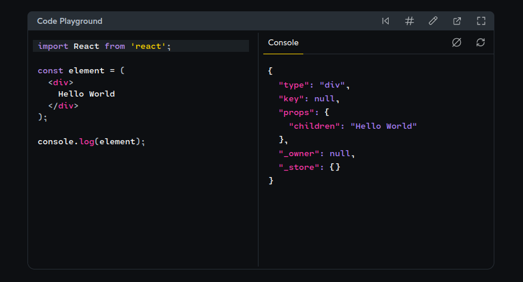

# Chap 5 | Components

Anki ➡️ 05-components

**Q1**:What do you mean by the statement "React is a component based framework " ? 

**Solution**:

- A component is a bundle of markup, styles and logic that controls everything about a specific part of the user interface
- In React components are the main mechanism of reuse

------


**Q2**: What is the Big Component Rule ? 

**Solution**:

React components need to start with a capital letter .This is how the JSX compiler can tell whether we are trying to render a built-in HTML tag or a custom React component  . We have to enforce this rule because even if we have a new rule say Components can't share names with HTML tags but this will not work because every now and then we get a new HTML tag! . The list of HTML tags isn't set in stone. 

The convention is to use PascalCase for all React component names


**Q**:How are these 2 JSX elements transpiled to JS  ? 

```JSX
const heading = <h1>Hello!</h1>
const greeting = <FriendlyGreeting />
```

**Solution**:

These are how these 2 JSX elements are transpiled to JS

```jsx 
const heading = React.createElement('h1', null, 'Hello!');
const greeting = React.createElement(FriendlyGreeting, null);
```

**A React element is a description of a thing we want to create.** In some cases, we want to create a DOM node, like an `<h1>` or a `<p>`. In other cases, we want to create a *component instance*.

The first argument that we pass to `React.createElement` is the “type” of the thing we want to create. For the first element, it's a string (`"h1"`). For the second element, it's a *function!* It's `FriendlyGreeting`, and not `"FriendlyGreeting"`.

---

**Q3**:What is props ? 

**Solution**:

Props are like arguments to a function :they allow us to pass data to our components so that the component can include customizations based on the data 


Example ➡️

```jsx
import React from 'react';
import { createRoot } from 'react-dom/client';

function FriendlyGreeting({ name }) {
  return (
    <p
      style={{
        fontSize: '1.25rem',
        textAlign: 'center',
        color: 'sienna',
      }}
    >
      Greetings, {name}!
    </p>
  );
}

// The video was filmed using React 17, but this code
// has been updated for React 19:
const root = createRoot(document.querySelector('#root'));
root.render(
  <div>
    <FriendlyGreeting name="Josh" />
    <FriendlyGreeting name="Anita" />
    <FriendlyGreeting name="Rahul" />
  </div>
);
```


---

**Q4**:How to pass default value to props ?

**Solution**:

To pass default values to props we do the following

```jsx
function FriendlyGreeting({ name = 'there' }) {

return (

Hey {name}

);

}
```

**Q5**:What is the children prop ? 

**Solution**:

In a typical HTML button the content goes in-between the open and close tags 

```html
<button>
  Don't click me
</button>
```

As a nice bit of syntactic sugar , React lets us do the same thing with our custom components

```html
root.render(

<RedButton>

    Don't click me

</RedButton>

);
```

When we do this, we can access the children through the `children` prop:

```jsx
function RedButton({ children }) {

  return (

<button

  style={{

    color: 'white',

    backgroundColor: 'red',

  }}

>

  {children}

</button>

  );

}
```

This is a quality-of-life thing that React does for us. When we pass 
something between the open and close tags, React will automatically 
supply that value to us under `children`.



---

**Q6**:Why React team came with children prop ? 

**Solution**:

Let's suppose that we're building a custom *button* component. It should look and act just like a regular HTML button, but it should have a red background and white text.

We could write it like this:

```js
function RedButton({ contents }) {

  return (

    <button

      style={{

        color: 'white',

        backgroundColor: 'red',

      }}

    >

      {contents}

    </button>

  );

}
```

…And then we'd use it like this:

```jsx
root.render(

<RedButton contents="Don't click me" />

);
```

This is a little bit different compared to a typical HTML button where the content goes in-between the open and close tags:

```jsx
<button>
  Don't click me
</button>
```

As a nice bit of syntactic sugar , React lets us do the same thing with our custom components:

```jsx
root.render(

<RedButton>

    Don't click me

</RedButton>

);
```

When we do this, we can access the children through the `children` prop:

```jsx
function RedButton({ children }) {

  return (

<button

  style={{

    color: 'white',

    backgroundColor: 'red',

  }}

>

  {children}

</button>

  );

}
```

This is a quality-of-life thing that React does for us. When we pass 
something between the open and close tags, React will automatically 
supply that value to us under `children`.


children is a special value , a "reserved word" when it comes to props .But it's not that special .If we wanted to , we could pass childrem in the traditional way .It's clunky , but the outcome is the same

```jsx
// This element:

<div children="Hello world!" />

// …is equivalent to this one:

<div>

  Hello world!

</div> 
```

---

**Q7**:What happens if we pass both forms of the children prop ? 

```jsx
import React from 'react';
import { createRoot } from 'react-dom/client';

const element = (
  <div children="As an attribute">
    Between the brackets
  </div>
);

const root = createRoot(
  document.querySelector('#root')
);
root.render(element);
```

**Solution**:

React chooses to prioritize the `children` passed in-between the open/close tages

This is what the copiled JS would look like:

```jsx
const element = React.createElement(

  'div',

  {

    children: 'As an attribute',

  },

  'Between the brackets',

);
```

This strongly suggests that the React team made an intentional decision to manually overwrite the `children` value in the props object with the `children` argument supplied afterwards