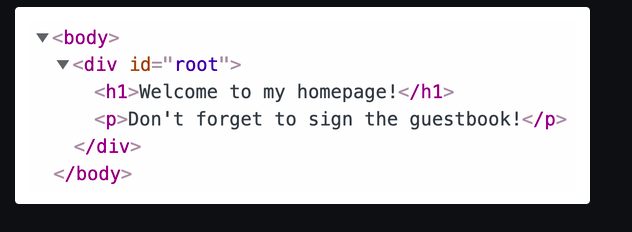

# Chap 7 | Fragments

Anki => 07-fragments

**Q1**:

```jsx
import React from 'react';

function App() {
  return (
    <h1>Welcome to my homepage!</h1>
    <p>Don't forget to sign the guestbook!</p>
  );
}

export default App;
```


The error message is telling us to use a "JSX fragment" .Why does this produce an error ? 

**Solution**:

If we convert it into pure JS we see this 

```jsag-0-1j7ehd195ag-1-1j7ehd195
function App() {
  return (
    React.createElement('h1', {}, 'Welcome to my homepage!')
    React.createElement('p', {}, "Don't forget to sign...")
  );
}
```

We have two separate `React.createElement` function calls, and we're trying to return *both* of them. This isn't allowed in JavaScript!

To move away from React altogether, it's the equivalent of trying to do this:

```jsx
function something() {

let arr = [1, 2, 3];

return (
    arr.push(4)
    arr.push(5));

}
```

Return statements have space for a single expression, but we're packing two expressions in there!

---

**Q2**:

```jsx
import React from 'react';

function App() {
  return (
    <h1>Welcome to my homepage!</h1>
    <p>Don't forget to sign the guestbook!</p>
  );
}

export default App;
```


Can we use a div to get around the Fragments error ? 

**Solution**:

We can use a div to get around the Fragments error but it pollutes the DOM with innecessary elements and it can even lead to accessibility and layout issues:

---

**Q3**:

What is a React Fragment ? 

**Solution**:

A fragment is a special React component that does not produce a DOM node

```jsx
import React from 'react';

function App() {
  return (
    <React.Fragment>
      <h1>Welcome to my homepage!</h1>
      <p>Don't forget to sign the guestbook!</p>
    </React.Fragment>
  );
}

export default App;
```

If we inspect the output in our developer tools, we see that our two HTML elements, `<h1>` and `<p>`, sit directly inside the container element (`<div id="root">`):



Fragments allow is to respect the rules of JavaScript without polluting the HTML

React fragments can also be created using the following syntax

```jsx
return (
  <>
    <h1>Welcome to my homepage!</h1>
    <p>Don't forget to sign the guestbook!</p>
  </>
);
```

Either way, the JSX will compile to the exact same JavaScript:

```jsx
React.createElement(
 React.Fragment,
 {},
 /* Children here */
);
```
