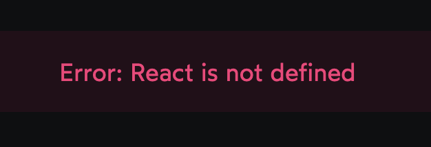

# Understanding JSX

Very few developers create elements using *React.createElement* .It's much more common to use a specialized syntax called JSX

Hello World using JSX ➡️

index.html ➡️

```html
<html>
<body>

  <div id="root"></div>

</body>
</html>
```

index.js ➡️

```js
import React from 'react';
import { createRoot } from 'react-dom/client';

const element = (

  <p id="hello">
    Hello World!
  </p>

);

const container = document.querySelector('#root');
const root = createRoot(container);
root.render(element);
```

Why the parenthesis ? 

In the example above, we wrap the JSX in parentheses, like this:

```jsx
const element = (

  <nav id="main-nav">
    <ul>
      (List items removed, for brevity)
    </ul>
  </nav>

);
```

This is done purely for formatting purposes. It allows us to push the JSX onto the next line.


Note ➡️ VVIP 

**Why do we need JSX ?** 

React elements can form a tree structure (This happens when we set the children parameter of a React element to another React element )

In practise we often wind up with pretty significant tree structure in our React code

```js
const element = React.createElement(
  "nav",
  { id: "main-nav" },
  React.createElement(
    "ul",
    null,
    React.createElement(
      "li",
      null,
      React.createElement(
        "a",
        { href: "/" },
        "Home"
      )
    ),
    React.createElement(
      "li",
      null,
      React.createElement(
        "a",
        { href: "/archives" },
        "Archives"
      )
    )
  )
);
```

**Transpiling JSX into JS**
JS Engines dont understand JSX they only understand JS so we need to transpile our code into plain js .This is most commonly done as part of a build step using a tool called Babel .The JSX we write gets converted into *React.createElement* .By the time our code is running in the user's browser all of the JSX has been zapped out and we are left with a JS file full of nested *React.createElement* calls

Note ➡️ (VVIP)

**Transpiling vs Compiling**

compiling ➡️ Process of taking human-readable code and transforming it into machine-readable code . A compiler might take a high-level language like Python and convert it into machine code , low-level instructions that appear like gibberish to us 

transpiling ➡️ Taking one high level language and transforming it into another high-level language . For example we might transpile JS into python

**File extensions and JSX**

In the early days of React , any file that included JSX had to use the .jsx file extension .This was how we told the compiler that this file had some JSX in it and needs to be compiled to JS 

To ease out the friction in the development process the rules were loosened .Now we can include JSX in a .js file and everything will work perfectly (One exception is if you use Vite , a bundler created by the Vue team . This tool still enforces the no-JSX-in-JS-Files rule)

**Can we skip the React import ? **

```jsx
import React from 'react';
import { createRoot } from 'react-dom/client';


const element = (
  <p id="hello">
    Hello World!
  </p>
);


const container = document.querySelector('#root');
const root = createRoot(container);
root.render(element);
```

On the very first line, we're importing `React`, but we aren't actually using it anywhere…  Can we omit it?

After we compile away the JSX, we're left with the following code:

```js
import React from 'react';
import { createRoot } from 'react-dom/client';


const element = React.createElement(
  'p',
  { id: 'hello' },
  'Hello World!'
);


const container = document.querySelector('#root');
const root = createRoot(container);
root.render(element);
```

When the JSX is compiled into plain JS, the dependency makes itself clear. That `<p>` tag becomes a `React.createElement` call! It's obfuscated by the JSX.

In earlier versions of React, you'd get an error if you forgot to include the React import:



This error message produced a lot of confusion for beginners.This was such a common stumbling block for beginners that the React Team in React 17 introduced a new “JSX transformer”, used by Babel and other compilers. Essentially, it *automatically injects the import* during the build process.

For example, let's suppose we had this code:

```jsx
const element = (
  <p id="hello">
    Hello World!
  </p>
);
```

Using the modern JSX transformer, it will get compiled to:

```jsx
import { jsx as _jsx } from 'react/jsx-runtime';


const element = _jsx(
  'p',
  { id: 'hello' },
  'Hello World!'
);
```

`_jsx` is a fancy optimized version of `React.createElement`. It includes some shortcuts when we use certain React features like  Fragments or Portals. Otherwise, it does the exact same thing as `React.createElement`: it creates a React element.

And so, these days, we *don't* have to import React. The JSX compiler will solve this problem for us.

**Expression Slots**:

- In JSX, the content we put between open/close tags is treated as a static  string. If we try and reference a variable, it'll print the variable  name itself, rather than the value it references.
- We can create *expression slots* with curly brackets (`{}`). Anything placed in-between curly brackets will be treated as pure JavaScript, instead of a string.
- There aren't a lot of rules when it comes to JSX. The compilation process  doesn't check if it's even valid! It's the messenger; it forwards the  content along to the pure JS output.
- Because JSX turns into `React.createElement()` function calls, we'll get a JavaScript syntax error if we try and place a statement in that slot. It has to be an *expression*.

**Comments in JSX**:

To add a comment in JSX, we use an expression slot:

```jsx
const element = (

  <div>
    {/* Some comment! */}
  </div>

);
```

We specifically need to use the multi-line comment syntax (`/* */`) instead of the single-line syntax (`//`). This is because the single-line syntax comments *everything* out, including the closing `}` for the expression slot!


**Attribute Expression Slots**:

To give dynamic attribute values we use expression slots

```jsx
const uniqueId = 'content-wrapper';


const element = (
  <main id={uniqueId}>
    Hello World
  </main>
);
```

 The squiggly brackets (`{}`) allow us to create an *expression slot*. This time, we're creating a slot for the value of the `id` attribute.

Here's how it compiles : 

```js
const element = React.createElement(
  'main',
  {
    id: uniqueId,
  },
  'Hello World'
);
```

We can use attribute expression slots whenever we need the values to be dynamic. We can put *any valid JavaScript* expression in here, not just variables:

```jsx
const userEmail = 'sumeet@thegreat.com';


const element = (
  <main id={userEmail.replace('@', '-')}>
    Hello World
  </main>
);


// Will get compiled as:
const compiledElement = React.createElement(
  'main',
  {
    id: userEmail.replace('@', '-'),
  },
  'Hello World'
);
```

Note that when we transpile the code, it doesn't actually get *evaluated.* We've written some logic which will turn that `userEmail` string into `"sumeet-thegreat.com"`, replacing the `@` character with a `-`, but that only happens when we *run* the code.

When JSX gets transpiled to JS, we copy over everything between the `{` and `}`. We don't call any functions or run any of the logic. That happens later, when the processed JavaScript runs in the browser.

This is the distinction between *transpile-time* (the code processing that happens before the code runs in the browser) and *run-time* (the code execution that happens in the browser).

**Type Coercion**:(We are supplying attributes in expression slots.What will the JSX expression be converted  into ar runtime )? 

- React will automatically convert types as needed when supplying attributes in expression slots
- In HTML , values must be strings and so the boolean true is converted to the string "true"
- Similarly the 1 and 20 is converted to "1" and "20"

```html
// This works:
<input required="true" />


// And so does this!
<input required={true} />

// ✅ Valid
<input type="range" min="1" max="20" />
// ✅ Valid
<input type="range" min={1} max={20} />
```

------

In HTML its possible to set attributes to true by specifying only the key 

```html
<input required > 
```

This same pattern has been implemented in JSX ; these two elements are equivalent 

```html
<input required />
<input required ={true}/>
```

However its not recommended doing this and preferred to spell it out and write `required={true}`

Why ? 

**Reason**:

```js
const name = 'Spot';
const dog = { name };


console.log(dog);
→ { name: 'Spot' }
```

When it comes to JavaScript objects, `{ name }` is equivalent to `{ name: name }`, and not `{ name: true }`.

JSX is a bit of a hybrid between HTML and JS, and so it can be ambiguous  for new developers. If we are  looking at JSX through an HTML lens, we would  expect the value to be `true`, but if you look at it through a JavaScript lens, you'd expect the value to be equal to the key.

In fact, there was even some talk about deprecating the “attribute-only”  syntax in JSX, to remove this ambiguity. In the end, the team decided to keep it for now, but it wouldn't be a surprise  if this was removed in the future.

And so, to keep things as simple and future-proof as possible, it is recommended to write the full thing out, `required={true}`.

**Differences from HTML**:

- We cant use JS reserved words in JSX(HTML attributes sometimes overlap with JS reserved words)

  - for (html) changes to htmlFor(JSX)
  - class(html) changes to className(JSX)

  - Note ➡️ To be a bit more specific : for and class work fine when we use them on native HTML elements but we run into problems if we try and use them on custom components

- In HTML even if we dont close a tag .The browser is smart enough to figure out that the tag must be closed. In JSX we need to close every tag we open In HTML the img tag does'nt need to be closed .In JSX we have to explicitly close this tag 
- Case-sensitive attributes
  - In JSX attributes need to be camelCase
    - autoplay(HTML)  ➡️ autoPlay(JSX)
    - onclick(HTML) ➡️ onClick(JSX)
    - tabindex(HTML) ➡️ tabIndex(JSX)
    - stroke-dash-array ➡️ strokeDashArray (JSX)
  - Note ➡️ There are two exceptions to this rule : data attributes and ARIA attributes

- inline styles 

  - in HTML the style attribute allows us to apply some styles inline to a specified element . In JSX style instead takes an object

  - All CSS properties are written in camelCase. Every dash is replaced by capitalizing the subsequent word 

    - background-position becomes backgroundPosition

  - React will automatically apply the px suffix for certain CSS properties (Its a common convention in React to use unitless values where possible but we can absolutely use full units if we prefer)

  - ```jsx
    <div
      style={{
        width: 200, // Equivalent to `width: 200px`
        paddingTop: 8, // Equivalent to `padding-top: 8px`
      }}
    >
    ```

**The whitespace gotcha**:

- In JSX to add a whitespace we use this hack `{" "}`

- On the web, whitespace serves two different purposes:

  - It creates grammatical space characters between words in sentences

  - It serves as indentation, to improve code readability for developers

- Any tool that processes HTML or JSX will need to figure out how to  interpret every single whitespace character. Should it be a space, or is it indentation?

- In HTML, every whitespace character (along with newline characters!) will  produce a single visible space. In some cases, this works to our  advantage, but in other circumstances, it gets in the way.

- For example, suppose we have 3 images that are meant to be side-by-side  (see code playground below). By default, HTML will render them with a  single whitespace character between them.

- It also depends on the layout algorithm. In Flexbox, the browser will  ignore all whitespace and indentation, just like the JSX compiler.

- The JSX trick of adding `{' '}`, therefore, may not be as hacky as it feels. It's a way of us to signify to the compiler that a whitespace character is meant to be a  grammatical space, and isn't indentation.

- Prettier is a tool that will automatically format our code for us.  It's opinionated, and follows conventions used by the majority of  JavaScript developers.

- Prettier knows about this whitespace gotcha, and will automatically add the `{' '}` whitespace character for us when it's necessary.

   