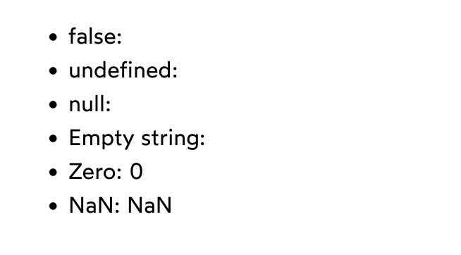

# Chap 9 | Conditional Rendering

## Conditional Rendering

------

Often in React, we'll want to render a chunk of markup based on some  condition. For example, maybe we want to include a little green dot next to the names of our friends who are currently online:


## Conditional Rendering with an if Statement

------

We want to conditionally render with an if statement but this sort of thing is illelegal 

*App.js* ➡️⬇️

```js
import Friend from './Friend'

function App() {
  return (
    <ul className="friend-list">
      <Friend name="Andrew" isOnline={false} />
      <Friend name="Beatrice" isOnline={true} />
      <Friend name="Chen" isOnline={true} />
    </ul>
  )
}

export default App;
```

*Friend.js* ➡️⬇️

```js
function Friend({ name, isOnline }) {
  return (
    <li className="friend">
      {if (isOnline) {
        <div className="green-dot" />
      }}

      {name}
    </li>
  );
}
```

If compile it to JS following would be the result ➡️

```js
function Friend({ name, isOnline }) {
  return React.createElement(
    'li',
    { className: 'friend' },
    if (isOnline) {
      React.createElement('div', { className: 'green-dot' });
    },
    name
  );
}
```

But we cant put an if in the middle of a function call like this .This would be equivalent to this ➡️

```js
console.log(
  if (isLoggedIn) {
    "Logged in!"
  } else {
    "Not logged in"
  }
)
```

We can still use an if statement .But we have to pull it up so that it's not in the middle of a `React.createElement` call:

*App.js* ➡️⬇️

```js
import Friend from './Friend'

function App() {
  return (
    <ul className="friend-list">
      <Friend name="Andrew" isOnline={false} />
      <Friend name="Beatrice" isOnline={true} />
      <Friend name="Chen" isOnline={true} />
    </ul>
  )
}

export default App;
```

*Friend.js* ➡️⬇️

```js
function Friend({ name, isOnline }) {
  let prefix;

  if (isOnline) {
    prefix = <div className="green-dot" />;
  }

  return (
    <li className="friend">
      {prefix}
      {name}
    </li>
  );
}

export default Friend;
```

There is no rule that says that our JSX has to be part of the return statement.We can absolutely assign chunks of JSX to a variable , anywhere within our component defination!

The JSX compiles to this:

```jsx
function Friend({ name, isOnline }) {
  let prefix;

  if (isOnline) {
    prefix = React.createElement(
      'div',
      { className: 'green-dot' }
    );
  }

  return React.createElement(
    'li',
    { className: 'friend' },
    prefix,
    name
  );
}
```

Note 💥

Consider the following code:

```jsx
function Greeting() {
  let someClass;

  return (
    <div className={someClass}>
      Hello World
    </div>
  );
}
```

The following HTML will be produced:

```html
<div>
  Hello World
</div>
```

In the code above, a variable named `someClass` is created, but it isn't given a value. This means that it resolves to `undefined`.

When React sees that an attribute is being set to `undefined`, it omits that attribute entirely from the DOM node. Rather than give it an empty value like `className=""`, it acts as though we haven't even tried to set a value.

This is true for some other falsy values as well, like `null` and `false`.

## Conditional rendering with &&

------

The downside with using an `if` statement is that we need to pull the logic up, away from the rest of the markup. While this is perfectly valid, it *can* make it harder to understand how a component is structured, especially  in larger and more-complex components. We'd have to hop all over the  place to understand what gets returned!

There is a way for us to embed the if logic right in our JSX: using the && operator. 

Here's how we'd do it:

App.jsx ➡️⬇️

```jsx
function Friend({ name, isOnline }) {
  return (
    <li className="friend">
      {isOnline && <div className="green-dot" />}
      {name}
    </li>
  );
}

function App() {
  return (
    <ul className="friend-list">
      <Friend name="Andrew" isOnline={false} />
      <Friend name="Beatrice" isOnline={true} />
      <Friend name="Chen" isOnline={true} />
    </ul>
  );
}

export default App;
```

In JS , && is a control flow operator .It works quite a bit like if/else, except it's an expression instead of a statement

Let's take a look at the exact same logic , but expressed using `if/else`: 

```js
function Friend({ name, isOnline }) {
  let prefix;
  if (isOnline) {
    prefix = <div className="green-dot" />;
  } else {
    prefix = isOnline;
  }

  return (
    <li className="friend">
      {prefix}
      {name}
    </li>
  );
}
```

The `&&` operator is said to be a “control flow” operator because, like if/else, it will always result in one of two paths being taken.

If the left-hand value (`isOnline`) is falsy, the expression short-circuits, and evaluates to `isOnline`, which resolves to `false`. If that value is truthy, however, it evaluates to whatever's on the right-hand side of the operator (`<div className="green-dot" />`).

## Common gotcha : the number zero

------

Consider this situation : 

```js
function App() {
  const shoppingList = ['avocado', 'banana', 'cinnamon'];
  const numOfItems = shoppingList.length;

  return (
    <div>
      {numOfItems && (
        <ShoppingList items={shoppingList} />
      )}
    </div>
  );
}
```

We wind up with `0` being rendered 

Why is this happening ? 

1. The `&&` operator doesn't return `true` or `false`. It returns either the left-hand side or the right-hand side. So, when our list is empty, this expression evaluates to `0`.
2. React will render any number you give it, even zero!

React will ignore most falsy values like `false` or `null`, but it won't ignore the number zero.

In face , let's see how React handles all of the different falsy values:

```js
function App() {
  return (
    <ul>
      <li>false: {false}</li>
      <li>undefined: {undefined}</li>
      <li>null: {null}</li>
      <li>Empty string: {''}</li>
      <li>Zero: {0}</li>
      <li>NaN: {NaN}</li>
    </ul>
  );
}

export default App;
```

This will be the result ➡️



React will actually render the number `0`. And when we think about it, this makes sense. There are lots of situations where we'd *want* to render this number:

```jsx
function Banner({ ticketsRemaining }) {
  return (
    <h2>
      Number of JIRA tickets left: {ticketsRemaining}.
    </h2>
  );
}
```

If `ticketsRemaining` is equal to `0`, we want to show the number `0`, not an empty space!

To avoid having random `0` charcaters sprinked around our application make sure to follow this **golden rule**:

**golden rule** ➡️ make sure that the left-hand side of && always evaluates to  a boolean value , either `true` or `false` 

For example , we can check if the number is greater than zero:

```jsx
function App() {
  const shoppingList = ['avocado', 'banana', 'cinnamon'];
  const numOfItems = shoppingList.length;

  return (
    <div>
      {numOfItems > 0 && (
        <ShoppingList items={shoppingList} />
      )}
    </div>
  );
}
```

We're being really specific with what the condition is: if we have 1 or more items in the shopping list, we should render the `<ShoppingList>` element. The “greater than” operator (`>`) will always produce a boolean value, either `true` or `false`.

We can also convert any non-boolean value to a boolean value with `!!`:

```jsx
function App() {
  const shoppingList = ['avocado', 'banana', 'cinnamon'];
  const numOfItems = shoppingList.length;

  return (
    <div>
      {!!numOfItems && (
        <ShoppingList items={shoppingList} />
      )}
    </div>
  );
}
```

Note ➡️

**ESLint rule**:

There is a handy ESLint rule that will warn you when your expressions could potentially result in an unexpected `0` or `NaN` showing up in the UI: [jsx-no-leaked-render ](https://github.com/jsx-eslint/eslint-plugin-react/blob/master/docs/rules/jsx-no-leaked-render.md)

## Conditional rendering with Ternary Operator

------

The `&&` operator allows us to conditionally render something if a condition is met. But what if we want to render something *else* if the condition *isn't* met?

For example, suppose we're building an admin dashboard. If the user is  logged in, we want to render the charts and tables and everything. If  they're *not* logged in, we want to render a short message asking them to log in.

Here's how we achieve it with **ternary operator**:

```jsx
function App({ user }) {
  const isLoggedIn = !!user;


  return (
    <>
      {isLoggedIn
        ? <AdminDashboard />
        : <p>Please login first</p>}
    </>
  );
}
```

**Short Circuiting**:

What do you think will happen when the following code runs ? 

```js
console.log('condition')
  ? console.log('first condition')
  : console.log('second condition');
```

First, the condition needs to be evaluated, so that we know which "branch" to follow. All `console.log` expressions evaluate to `undefined`, which is a falsy value, and so the "second condition" branch is followed.

The interesting thing here is that the code in that first branch *is never executed*. We'll never see "first condition" in our console.

The `&&` operator works in much the same way:

```js
false && console.log('I will never run!');
// Nothing is logged
```

When the evaluator sees that the left-hand value is falsy, it "short-circuits" and ignores everything that comes afterwards.

In other words, it's safe to do something like this:

```js
const networkRequest = isLoggedIn && fetch('/user/login-details');
```

The `fetch()` call will only execute if `isLoggedIn` is true. So we don't have to worry about "wasted" network requests.

