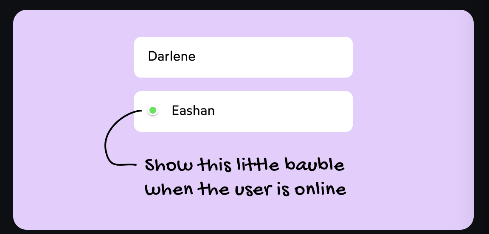

# Chap 9 | Conditional Rendering

## Conditional Rendering

------

Often in React, we'll want to render a chunk of markup based on some  condition. For example, maybe we want to include a little green dot next to the names of our friends who are currently online:



## With an if Statement

------

We want to conditionally render with an if statement but this sort of thing is illelegal 

*App.js* ➡️⬇️

```js
import Friend from './Friend'

function App() {
  return (
    <ul className="friend-list">
      <Friend name="Andrew" isOnline={false} />
      <Friend name="Beatrice" isOnline={true} />
      <Friend name="Chen" isOnline={true} />
    </ul>
  )
}

export default App;
```

*Friend.js* ➡️⬇️

```js
function Friend({ name, isOnline }) {
  return (
    <li className="friend">
      {if (isOnline) {
        <div className="green-dot" />
      }}

      {name}
    </li>
  );
}
```

If compile it to JS following would be the result ➡️

```js
function Friend({ name, isOnline }) {
  return React.createElement(
    'li',
    { className: 'friend' },
    if (isOnline) {
      React.createElement('div', { className: 'green-dot' });
    },
    name
  );
}
```

But we cant put an if in the middle of a function call like this .This would be equivalent to this ➡️

```js
console.log(
  if (isLoggedIn) {
    "Logged in!"
  } else {
    "Not logged in"
  }
)
```

We can still use an if statement .But we have to pull it up so that it's not in the middle of a `React.createElement` call:

*App.js* ➡️⬇️

```js
import Friend from './Friend'

function App() {
  return (
    <ul className="friend-list">
      <Friend name="Andrew" isOnline={false} />
      <Friend name="Beatrice" isOnline={true} />
      <Friend name="Chen" isOnline={true} />
    </ul>
  )
}

export default App;
```

*Friend.js* ➡️⬇️

```js
function Friend({ name, isOnline }) {
  let prefix;

  if (isOnline) {
    prefix = <div className="green-dot" />;
  }

  return (
    <li className="friend">
      {prefix}
      {name}
    </li>
  );
}

export default Friend;
```

There is no rule that says that our JSX has to be part of the return statement.We can absolutely assign chunks of JSX to a variable , anywhere within our component defination!

The JSX compiles to this:

```jsx
function Friend({ name, isOnline }) {
  let prefix;

  if (isOnline) {
    prefix = React.createElement(
      'div',
      { className: 'green-dot' }
    );
  }

  return React.createElement(
    'li',
    { className: 'friend' },
    prefix,
    name
  );
}
```

Note 💥

Consider the following code:

```jsx
function Greeting() {
  let someClass;

  return (
    <div className={someClass}>
      Hello World
    </div>
  );
}
```

The following HTML will be produced:

```html
<div>
  Hello World
</div>
```

In the code above, a variable named `someClass` is created, but it isn't given a value. This means that it resolves to `undefined`.

When React sees that an attribute is being set to `undefined`, it omits that attribute entirely from the DOM node. Rather than give it an empty value like `className=""`, it acts as though we haven't even tried to set a value.

This is true for some other falsy values as well, like `null` and `false`.

