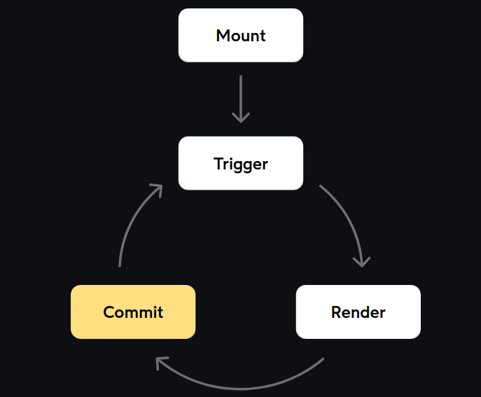

# Chap 3 | The useState Hook

## Minimal Counter App with useState Hook

```jsx
import React from 'react';

function Counter() {
  const [count, setCount] = React.useState(0);

  return (
    <button onClick={() => setCount(count + 1)}>
      Value: {count}
    </button>
  );
}

export default Counter;
```

Our goal is to keep track of the number of times the user has clicked the button. Whenever we have “dynamic” values like this, we need to use React state. State is used for values that change over time.

To create a state variable, we use the `useState` function. This function takes a single argument: the initial value. In this case, that value initializes to `0`. This value is chosen because when the page first loads, we've clicked the button 0 times.

`useState` is a *hook*. A hook is a special type of function that allows us to "hook into" 
React internals. 

The `useState` hook returns an array containing two items:

1. The current value of the state variable. We've decided to call it `count`.

2. A function we can use to update the state variable. We named it `setCount`.

## Initial State

React state variables can be given an initial value:

```jsx
const [count, setCount] = React.useState(1);
console.log(count); // 1
```

We can also supply a *function*. React will call this function on the very first render to calculate the initial value:

```jsx
const [count, setCount] = React.useState(() => {
  return 1 + 1;
});

console.log(count); // 2
```

This is sometimes called an *initializer function*.It can occasionally be useful if we need to do an expensive operation to calculate the initial value. For example, reading from Local Storage:

```jsx
const [count, setCount] = React.useState(() => {
  return window.localStorage.getItem('saved-count');
});
```

If you're not familiar with the Local Storage API, it's a way for us to save values on the user's device, so that it persists even after the browser tab is closed, and can be accessed on their next visit.

The benefit here is that we're only doing the expensive work (reading from 
Local Storage) once, on the initial render, rather than doing it on every single render.

## What exactly is the difference between these 2 forms ?

```jsx
// Form 1:
const [count, setCount] = React.useState(
  window.localStorage.getItem('saved-count')
);

// Form 2:
const [count, setCount] = React.useState(() => {
  return window.localStorage.getItem('saved-count');
});
```

Let's say we have this function:

```js
function run() {
  console.log('Hello');
}
```

Whenever I call the `run` function, we'll log the word "Hello". If I call the function 5 times, I'd get 5 "Hello"s in the console.

Now, suppose we tweak it:

```js
function run() {
  const sayHi = () => {
    console.log('Hello');
  };
}
```

Now, when I call the `run` function, nothing is logged to the console. That's because the `console.log` is packaged up in an inner function, `sayHi`. Every time we call the `run` function, we're *creating* a brand new `sayHi` function, but we're never *calling* it.

Alright, now let's look at the React code again:

```js
function Counter() {
  const [count, setCount] = React.useState(
    window.localStorage.getItem('saved-count')
  );
}
```

Whenever we render the `Counter` component, this function will be called, and all of the code inside will run. We'll call `window.localStorage` on every single render, and pass the value into `React.useState`.

Now, let's consider the secondary form:

```jsx
function Counter() {
  const [count, setCount] = React.useState(() => {
    return window.localStorage.getItem('saved-count');
  });
}
```

In this case, we're *creating a function*:

```jsx
() => {
  return window.localStorage.getItem('saved-count');
}
```

This *function* is being passed into `React.useState()`. And so it's up to React to decide what to do with it.

On the very first render, React will call this function to calculate the initial value. On *subsequent* renders, however, React ignores the function. The initial value has 
already been calculated, and so there's no reason to call the function 
again.

## Core React Loop

Lets see at an example of a Counter app => 

```js
function Counter() {
  const [count, setCount] = React.useState(0);

  return (
    <button onClick={() => setCount(count + 1)}>
      Value: {count}
    </button>
  );
}
```

Let's talk about what happens when this component is rendered for the first time.

Our `Counter` function returns a bunch of JSX. Let's rewrite it in pure JavaScript, so we can see what's really going on here:

```jsx
function Counter() {
  const [count, setCount] = React.useState(0);

  return React.createElement(
    'button',
    { onClick: () => setCount(count + 1) },
    'Value: ',
    count
  );
}
```

When this code runs, `React.createElement` produces a React element, which is a plain JavaScript object. It looks something like this:

```js
{
  type: 'button',
  key: null,
  ref: null,
  props: {
    onClick: () => setCount(count + 1),
    children: 'Value: 0',
  },
  _owner: null,
  _store: { validated: false }
}
```

React elements are essentially descriptions of the UI we want. We're saying in this case that we want a button that contains the text “Value: 0”.

We could *visualize* this JavaScript object as the following HTML snippet:

```html
<button>
  Value: 0
</button>
```

Our React element, that JavaScript object, is describing this DOM structure. React takes that description, and turns it into the real thing. It creates a `<button>` DOM node and appends it to the page.

We didn't show the `onClick` handler in this little sketch, but it's very much a part of this process. When React creates and injects the `<button>` DOM node, it attaches our handler function.

**Now, let's think about what happens when this button is clicked.**

The `setCount` function will be called, and we'll pass in a new value. `count` will be incremented, from 0 to 1.

**Whenever a state variable is updated, it triggers a *re-render*.** Once again, React will call the `Counter` function. This creates a brand-new React element, a new description of the UI we want.

The new React element describes this DOM structure:

```jsx
<button>
  Value: 1
</button>
```

(I'm showing it here as HTML since it's easier to demonstrate, but 
really, React deals with JavaScript objects that describe this markup.)

**Each render is like taking a snapshot.** We generate a description that shows what the UI should look like, based on the component's props/state. It's like a photo that captures what things were like at a moment in time.

And so, React has two snapshots:

Snapshot 1 :

```html
<button>
  Value: 0
</button>
```

Snapshot 2 :

```html
<button>
  Value: 1
</button>
```

The user clicked the button, and this second snapshot was generated. React now has to figure out how to *update* the DOM, so that it matches this latest snapshot.

React essentially has to play this sort of game, hunting for changes between the two snapshots.

This process is known as *reconciliation*.Using fancy optimized algorithms, React figures out what's changed. It sees that the button's text content has changed from "Value: 0" to "Value: 1".

Once React has solved the puzzle and worked out what's different, it will need to *commit* these changes. With surgical precision, it updates the DOM, taking care to only tweak the things that need to be tweaked.

In this case, the operation would be something like:

```js
button.innerText = "Value: 1";
```

## Core React Loop



**Mount:**

When we render the component for the first time , there is no previous snapshot to compare to.And so , React will create all of the necessary DOM nodes from scratcg , and inject them into the page. 

**Trigger**:

Eventually , something happens that triggers a state change, invokig the "setX" function (eg. setCount).We're telling React that the value of a  state variable has just been updated

**Render:**

Because the state changed, we need to generate a new description of the UI! React will *reconcile* it, comparing it to the previous snapshot , and figuring out what needs to happen in order for the DOM to match this latest snapshot

**Commit:**

If any DOM updates are required,React will perform those mutations(eg Changing the text content of a DOM node , creating new nodes, deleting removed nodes , etc)

Once the changes have been committed ,React goes idle , and waits for the next trigger , the next state change.

## Render vs Re-paint

Suppose we have the following component: 

```js
function AgeLimit({ age }) {
  if (age < 18) {
    return (
      <p>You're not old enough!</p>
    );
  }

  return (
    <p>Hello, adult!</p>
  );
}
```

Our `AgeLimit` component checks an `age` prop and returns one of two paragraphs.

Now, let's suppose we re-render this component, and wind up with the following before/after pair of snapshots:

Snapshot 1 : 

```js
age: 16

{
  type: 'p',
  key: null,
  ref: null,
  props: {},
  children: "You're not old enough!",
}
```

```js
age: 17

{
  type: 'p',
  key: null,
  ref: null,
  props: {},
  children: "You're not old enough!",
}
```

In both cases, `age` is less than 18, and so we wind up with **the exact same UI**. As a result, *no DOM mutation happens at all.*

So, when we talk about “re-rendering” a component, we aren't *necessarily* saying that anything will change in the DOM! We're saying that React is going to check if anything's changed. *If* React spots a difference between snapshots, it'll need to update the DOM, but it will be a precisely-targeted minimal change.

When React *does* change a part of the DOM, the browser will need to *re-paint*.
 A re-paint is when the pixels on the screen are re-drawn because a part
 of the DOM was mutated. This is done natively by the browser when the 
DOM is edited with JavaScript (whether by React, Angular, jQuery, 
vanilla JS, anything).

To summarize:

- A *re-render* is a React process where it figures out what needs to change (AKA. “reconciliation”, the spot-the-differences game).

- *If* something has changed between the two snapshots(snapshot => Represntation what the UI will look like), React will 
  “commit” those changes by editing the DOM, so that it matches the latest
   snapshot.

- Whenever a DOM node is edited, the browser will *re-paint*, re-drawing the relevant pixels so that the user sees the correct UI.

- **Not all re-renders require re-paints!** If nothing has changed between snapshots, React won't edit any DOM nodes, and nothing will be re-painted.

The critical thing to understand is that when we talk about “re-rendering”, we're **not** saying that we should throw away the current UI and re-build everything from scratch.

React tries to keep the re-painting to a minimum, because re-painting is 
slow. Instead of generating a bunch of new DOM nodes from scratch (lots 
of painting), it figures out what's changed between snapshots, and makes
 the required tweaks with surgical precision.

## Asynchronous Updates

Time tocover our frst state-based footgun (A footgun is a part of a 
library/framework that tends to cause problems for developers, since 
they inadvertently shoot themselves in the foot trying to use it!)

What value would we expect to see in the developer console when the user clicks the button for the first time ? 

```jsx
function App() {
  const [count, setCount] = React.useState(0);

  return (
    <>
      <p>
        You've clicked {count} times.
      </p>
      <button
        onClick={() => {
          setCount(count + 1);

          console.log(count)
        }}
      >
        Click me!
      </button>
    </>
  );
}
```

State setters aren't immediate. When we call `setCount`, we tell React that we'd like to request a change to a state variable. React doesn't immediately drop 
everything; it waits until the current operation is completed (processing the click), and then it updates the value and triggers a re-render.**Updating a state variable is asynchronous.** It affects what the state will be *for the next render*. It's a scheduled update.

## Why is updating a state variable asynchronous ?

Lets take a look at some code :

```jsx
import React from 'react';

function App() {
  const [user, setUser] = React.useState({ name: 'Alyssa' });
  const [status, setStatus] = React.useState('ready');
  const [confirmationMessage, setConfirmationMessage] = React.useState();

  if (!user) {
    return <p>{confirmationMessage}</p>;
  }

  return (
    <button
      onClick={() => {
        setUser(null);
        setStatus('initial');
        setConfirmationMessage("You have been logged out.");
      }}
    >
      Log Out
    </button>
  );
}

export default App;
```

When the user clicks the big “Log Out” button, here's what happens:

1. The `setUser` function is called. React makes a note of this, assigning itself a metaphorical Jira? ticket. `user` will be changed to `null`.

2. Then, on the next line, `setStatus` is called. React *edits* the Jira ticket, noting that on the next render, *two* state variables have to change.

3. Finally, `setConfirmationMessage` is called. React edits the ticket again. It now knows the new value for all 3 state variables.

Once this `onClick` handler wraps up, React springs into action, performing all the steps we learned about in the Core React Loop lesson. It invokes the `App` function, `user` is initialized to `null`, and a paragraph is returned. React deletes the `<button>` DOM node, produces a new `<p>` DOM node, and the re-render is completed.

**Now, let's imagine if state updates were synchronous.**

When the user clicks the button, the click handler would be called, and `setUser(null)` would run. React would *immediately* do the re-render, performing all of the steps we talked about. It calls the `App` function, gets the result, destroys the button, creates a paragraph.

Only after all that, it resumes what it was doing in the `onClick` handler. And, immediately, another re-render is triggered for the `status` variable. And then, after all that, a third re-render for `confirmationMessage`.

We'dbe forcing react to do 3x the amount of work, which would take 3x as 
long. So, it would be a performance liability. But it would also lead to
 inconsistent / broken UI!For example: if we did a re-render after the first `setUser` call, `user` would be `null`, but `confirmationMessage` would still be undefined, since we haven't gotten there yet! As a result, we'd wind up with the following JSX:

<p>{undefined}</p>

Because state updates are asynchronous, they can be *batched*. React schedules the update, to take place as soon as the current work is completed (in practice, this is usually within a millisecond or two, so it feels completely instantaneous).
