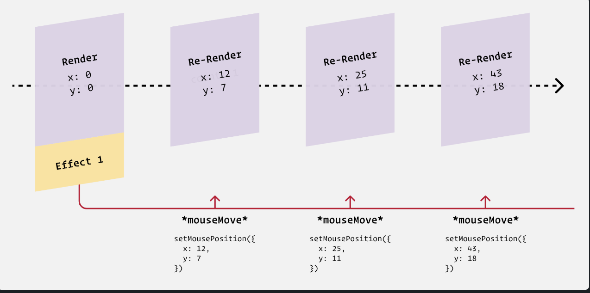

# Chap 6 | Side Effects

Anki ➡️ 06-side-effects

**Q1**:What are Side Effects ? 

**Solution**:

- **Core React Loop** ➡️ We give React a chunk of JSX and it produces the resulting DOM .When the JSX changes (eg because the state or props change), React will update the DOM to match, always keeping it in sync .This is React's main job , its primary purpose
- Things that fall outside of this main job like *updating the document's title* , *making network requests* , *interacting with local storage* are known as side effects 

**Q2**:Why React team gave us the `useEffect` hook ? 

**Solution**:

- Core React loop ➡️ We give React a chunk of JSX and it produces the resulting DOM .When the JSX changes (eg because the state or props change), React will update the DOM to match, always keeping it in sync .This is React's main job , its primary purpose
- Things that fall outside of this main job like updating the document's title , making network requests , interacting with local storage are known as side effects 
- React gives us a specific tool for managing side effects : the useEffect hook

**Q3**:Explain the useEffect Hook ? 

**Solution**:

**No dependency array** ➡️

`useEffect(() => { … })`

- Runs after every render , both initial and subsequent renders

**Empty dependency array**

`useEffect(() => { … }, [])`

- Runs only once , after the first render (component mount)

**Dependency array with variables**

`useEffect(() => { … }, [var1, var2])`

- Runs **after the first render**
- And then **any time any of the variables in the array change**.

**Q4**:Suppose we have the following code:

```jsx
function App() {
  const [count, setCount] = React.useState(0);

  React.useEffect(() => {
    console.log(count);
  }, []);

  return (
    <>
      <p>The count is: {count}</p>
      <button onClick={() => setCount(count + 1)}>
        Increment
      </button>
    </>
  );
}
```

-  If we run this code what error will we get ? 
- How to disable the error ? 
- Why do we get this error ? 
- How to fix the error ? 

**Solution**:

**The error that we will get** ➡️


**To disable the error we can do the following** ➡️

To disable the warning(we are not fixing the error) we can do the following : 

```jsx
React.useEffect(() => {
  console.log(count);
  // eslint-disable-next-line
}, []);
```

This magical incantation will silence the warning, but it doesn't solve the problem!

**Why do we get this error ? **

This rule isn't arbitrary, it's here for a very good reason: if we don't include the `count` state variable in the dependency array, we'll wind up in an *extremely* confusing situation.

Every time we re-render, by calling `setCount`, we take a new snapshot, and create a new `count` variable. This means that there are different "versions" of the `count` variable, one for each snapshot.

By not including `count` in the dependency array, it means that our effect is "frozen in time"; the `console.log(count)` code inside the effect only has access to the *first* `count` variable, the one equal to `0`.

It leads to this bewildering situation, when the state changes:

```jsx
function App() {
  // This `count` is equal to 3:
  const [count, setCount] = React.useState(0);

  React.useEffect(() => {
  // This `count` is equal to 0:
    console.log(count);
  }, []);

  return (
    <>
      {/* this `count` is equal to 3: */}
      <p>The count is: {count}</p>
      <button onClick={() => setCount(count + 1)}>
        Increment
      </button>
    </>
  );
}
```

Our effect has gotten out-of-sync with the rest of the code, and it  means that we're seeing multiple versions of the state at the same time.

**How to fix the error ? **

To fix it, we need to add `count` to the dependency array:

```jsx
React.useEffect(() => {
  console.log(count);
}, [count]);
```

This means that the effect will re-run whenever we call `setCount`, keeping it in sync as the state changes.

**Q5**:We are building an "auto-focussing" text input , one that captures focus when the component mounts We are capturing a reference to that input with the `useRef` hook . Input DOM nodes have a `focus()` method we can call to focus it and we are doing it right in the render

```jsx
function App() {
  const [
    searchTerm,
    setSearchTerm,
  ] = React.useState('');

  const inputRef = React.useRef();
  inputRef.current.focus();

  return (
    <main>
      <form>
        <input
          ref={inputRef}
          value={searchTerm}
          onChange={(event) => {
            setSearchTerm(event.target.value);
          }}
        />
        <button>Search</button>
      </form>
    </main>
  );
}
```

Unfortunately this leads to an error 


Why are we getting this error and how to fix it ? 

**Solution**:

The trouble is that when we first create the `inputRef`, it's empty (`{ current: undefined }`). It only captures the input DOM node *after* the first render.

The solution is to use the `useEffect` hook:

```jsx
function App() {
  const [
    searchTerm,
    setSearchTerm,
  ] = React.useState('');

  const inputRef = React.useRef();

  React.useEffect(() => {
    inputRef.current.focus();
  }, []);

  // ✂️
}
```

Critically, we're passing an *empty dependency array*. This is how we tell React, “this effect doesn't depend on any other values”.  And if it doesn't depend on any values, it'll never re-run!

Effects always run after the first render, and then again whenever the  dependencies change. This structure ensures it'll only run after the  first render.

**Q6**:

```JSX
function App() {
  const [
    searchTerm,
    setSearchTerm,
  ] = React.useState('');

  const inputRef = React.useRef();

  React.useEffect(() => {
    inputRef.current.focus();
  }, []);

  return (
    <main>
      <form>
        <input
          ref={inputRef}
          value={searchTerm}
          onChange={(event) => {
            setSearchTerm(event.target.value);
          }}
        />
        <button>Search</button>
      </form>
    </main>
  );
}
```

We are capturing the input DOM node with `const inputRef = React.useRef()` and triggering `.focus()` in an effect 

HTML form inputs have an `autofocus` property that can be used to automatically focus the element on page load

```html
<input autofocus type="text" />
```

Given that there's a built-in way to auto-focus an input, why are we going through all the trouble with `useRef` and `useEffect`??

**Solution**:

**Unfortunately, it isn't safe to use the `autofocus` attribute in React.**

The `autofocus` attribute only works reliably if the element is present when the page  first loads. It won't work if the element is dynamically injected into  the page afterwards.

And in React, **pretty much every element is dynamically injected!** The only exception is if you use server-side rendering, and even then,  only for the very first page the user visits on your site.

And so, the solution shown above, capturing an input with a ref and triggering `.focus()` in an effect, is the best way to solve this problem in React.

**Q7**: This component tracks the user’s mouse position in real time. It uses `useState` to store the cursor’s coordinates and `useEffect` to attach a `mousemove` event listener to the window. Every time the mouse moves, `setMousePosition` updates the `x` and `y` values, which are then displayed on the screen.

```jsx
import React from 'react';

function MouseCoords() {
  const [mousePosition, setMousePosition] = React.useState({
    x: 0,
    y: 0,
  });

  React.useEffect(() => {
    function handleMouseMove(event) {
      setMousePosition({
        x: event.clientX,
        y: event.clientY,
      });
    }
    window.addEventListener('mousemove', handleMouseMove);
  });

  return (
    <div className="wrapper">
      <p>
        {mousePosition.x} / {mousePosition.y}
      </p>
    </div>
  );
}

export default MouseCoords;
```

There are 2 issues with this code firstly we are not clearing up our event listener . What's the other issue and how can we fix it ? 

**Solution**:

We are adding multiple event listeners 

Because we haven't specified a dependency array, this effect will run after  every single render. That means every time the user's mouse position  changes, we call `window.addEventListener` *again*. If 100 mouse-move events fire, we'll have 100 event listeners.

**`window.addEventListener` is a subscription.** We only want to subscribe once, when the component first mounts.

Here's what the proper solution looks like:

Here's what the proper solution looks like: 

```js
React.useEffect(() => {
  function handleMouseMove(event) {
    setMousePosition({
      x: event.clientX,
      y: event.clientY,
    });
  }

  window.addEventListener('mousemove', handleMouseMove);
}, []);
```

`window.addEventListener` is not part of React, it's part  of the DOM. When we call this method, we set up a long-running process  that will call our callback function whenever the `mousemove` event is detected.

With an empty dependency array, the effect only runs once, after the first render, starting a single long-running process:



*Without* the empty dependency array, however, our effect runs after every render, starting multiple long-running processes:


Final Code ➡️

```jsx
import React from 'react';

function MouseCoords() {
  const [mousePosition, setMousePosition] = React.useState({
    x: 0,
    y: 0,
  });

  React.useEffect(() => {
    function handleMouseMove(event) {
      setMousePosition({
        x: event.clientX,
        y: event.clientY,
      });
    }
    window.addEventListener('mousemove', handleMouseMove);
  }, []);

  return (
    <div className="wrapper">
      <p>
        {mousePosition.x} / {mousePosition.y}
      </p>
    </div>
  );
}

export default MouseCoords;
```

