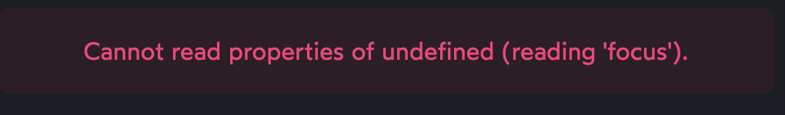
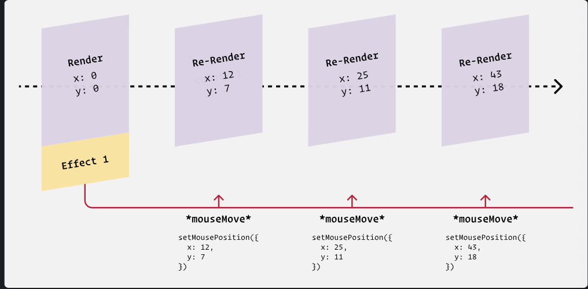
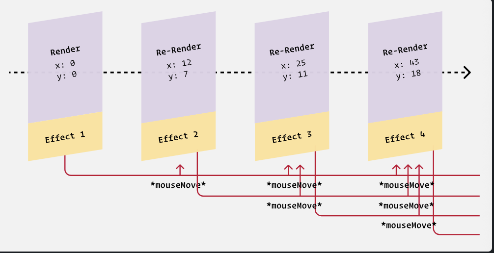

# Chap 6 | Side Effects

## Side Effects

As we build applications, we often need to synchronize with external systems. This can include things like:

- Making network requests
- Managing timeouts / intervals
- Reading/writing from localStorage

- Listening for global events

React calls all of these things “side effects”.

## The useEffect hook

- Core React loop : We give React a chunk of JSX, and it produces the resulting DOM. When  the JSX changes (eg. because the state or props change), React will  update the DOM to match, always keeping it in sync. This is React's main job, its primary purpose.
- But what about for things that fall *outside* of this main job? For example, what if we want to update the document's title, to include a state variable?
- This is known as a **side effect**. Other examples of side effects include interacting with Local Storage, or making network requests.
- React gives us a specific tool for managing side effects: the `useEffect` hook. We pass some code to `useEffect`, via a callback function, and React calls that function for us after each render.
- **Why not do the work directly in the component?** Well, we *can*, but `useEffect` gives us additional tools.
- We can specify *dependencies* so that the effect only runs sometimes, when a particular value has changed. For example:

```js
React.useEffect(() => {
  // Effect logic
  document.title = `(${count}) — Counter 2.0`;
}, [count]);
```

- By specifying `[count]`, we're saying that the effect logic should *only* run when the `count` variable changes.
- Effects always run after the very first render, no matter what we specify in our dependency array.

## Effect Lint Rules

Suppose we have the following code:

```jsx
function App() {
  const [count, setCount] = React.useState(0);

  React.useEffect(() => {
    console.log(count);
  }, []);

  return (
    <>
      <p>The count is: {count}</p>
      <button onClick={() => setCount(count + 1)}>
        Increment
      </button>
    </>
  );
}
```

If we try to run this code, we'll get a lint warning from React, telling us we're violating an ESLint rule: `react-hooks/exhaustive-deps`.

This is one of the most common rules to trip over, and the internet is full  of folks trying to understand how to fix it. Unfortunately, one of the  most common solutions is to *disable* the warning, rather than fixing it:

```jsx
React.useEffect(() => {
  console.log(count);
  // eslint-disable-next-line
}, []);
```

This magical incantation will silence the warning, but it doesn't solve the problem!

This rule isn't arbitrary, it's here for a very good reason: if we don't include the `count` state variable in the dependency array, we'll wind up in an *extremely* confusing situation.

Every time we re-render, by calling `setCount`, we take a new snapshot, and create a new `count` variable. This means that there are different "versions" of the `count` variable, one for each snapshot.

By not including `count` in the dependency array, it means that our effect is "frozen in time"; the `console.log(count)` code inside the effect only has access to the *first* `count` variable, the one equal to `0`.

It leads to this bewildering situation, when the state changes:

```js
function App() {
  // This `count` is equal to 3:
  const [count, setCount] = React.useState(0);

  React.useEffect(() => {
  // This `count` is equal to 0:
    console.log(count);
  }, []);

  return (
    <>
      {/* this `count` is equal to 3: */}
      <p>The count is: {count}</p>
      <button onClick={() => setCount(count + 1)}>
        Increment
      </button>
    </>
  );
}
```

Our effect has gotten out-of-sync with the rest of the code, and it  means that we're seeing multiple versions of the state at the same time.

To fix it, we need to add `count` to the dependency array:

```js
React.useEffect(() => {
  console.log(count);
}, [count]);
```

This means that the effect will re-run whenever we call `setCount`, keeping it in sync as the state changes.

## Running on Mount

we explore how we might build an “auto-focusing” text input, one that captures focus when the component mounts.

Suppose we have the following code:

```js
unction App() {
  const [
    searchTerm,
    setSearchTerm,
  ] = React.useState('');

  return (
    <main>
      <form>
        {/* I want to focus this input on mount: */}
        <input
          value={searchTerm}
          onChange={(event) => {
            setSearchTerm(event.target.value);
          }}
        />
        <button>Search</button>
      </form>
    </main>
  );
}
```

We can capture a *reference* to that input with the `useRef` hook, as we saw earlier:

```js
function App() {
  const [
    searchTerm,
    setSearchTerm,
  ] = React.useState('');

  const inputRef = React.useRef();

  return (
    <main>
      <form>
        <input
          ref={inputRef}
          value={searchTerm}
          onChange={(event) => {
            setSearchTerm(event.target.value);
          }}
        />
        <button>Search</button>
      </form>
    </main>
  );
}
```

Input DOM nodes have a `.focus()` method we can call to focus it, but how do I do it on mount?

I can try to do it right in the render:

```js
function App() {
  const [
    searchTerm,
    setSearchTerm,
  ] = React.useState('');

  const inputRef = React.useRef();
  inputRef.current.focus();

  // ✂️
}
```

Unfortunately, this leads to an error:



The trouble is that when we first create the `inputRef`, it's empty (`{ current: undefined }`). It only captures the input DOM node *after* the first render.

The solution is to use the `useEffect` hook:

```js
function App() {
  const [
    searchTerm,
    setSearchTerm,
  ] = React.useState('');

  const inputRef = React.useRef();

  React.useEffect(() => {
    inputRef.current.focus();
  }, []);

  // ✂️
}


```

Critically, we're passing an *empty dependency array*. This is how we tell React, “this effect doesn't depend on any other values”.  And if it doesn't depend on any values, it'll never re-run!

Effects always run after the first render, and then again whenever the  dependencies change. This structure ensures it'll only run after the  first render.

## The "autofocus" attribute

HTML form inputs have an `autofocus` property that can be used to automatically focus the element on page load:

```html
<input autofocus type="text" />
```

Given that there's a built-in way to auto-focus an input, why are we going through all the trouble with `useRef` and `useEffect`??

**Unfortunately, it isn't safe to use the `autofocus` attribute in React.**

The `autofocus` attribute only works reliably if the  element is present when the page first loads. It won't work if the  element is dynamically injected into the page afterwards.

And in React, **pretty much every element is dynamically injected!** The only exception is if you use server-side rendering, and even then,  only for the very first page the user visits on your site.

And so, the solution shown above, capturing an input with a ref and triggering `.focus()` in an effect, is the best way to solve this problem in React.

## Subscriptions

Let's suppose we want to track the user's cursor position. Whenever they move their mouse, we'll update some state.

We can add `onMouseMove` event handlers to specific DOM nodes, like this:

```jsx
<div
  onMouseMove={event => {
    setMousePosition({
      x: event.clientX,
      y: event.clientY,
    });
  }}
>
```

This will only work while the user is hovering over this particular `<div>`, though… What if we want to track their cursor position no matter where the mouse is within the viewport?

In order to listen for global events, you can use `window.addEventListener`

```jsx
import React from 'react';

function MouseCoords() {
  const [
    mousePosition,
    setMousePosition
  ] = React.useState({ x: 0, y: 0 });
  
  return (
    <div className="wrapper">
      <p>
        {mousePosition.x} / {mousePosition.y}
      </p>
    </div>
  );
}

export default MouseCoords;
```

To listen for global mouse-move events, we need to use `window.addEventListener`. We can register it in an effect hook, like this:

```jsx
React.useEffect(() => {
  function handleMouseMove(event) {
    setMousePosition({
      x: event.clientX,
      y: event.clientY,
    });
  }

  window.addEventListener('mousemove', handleMouseMove);
});
```

At first glance, this *seems* to work, **but there are two problems with this approach.**

First, we aren't ever cleaning up our event listener. Let's put that one on  the back burner for now; we'll talk about cleanup in [the next lesson](https://courses.joshwcomeau.com/joy-of-react/03-hooks/05.06-cleanup).

The issue I want to talk about is that **we're adding multiple event listeners.**

Because we haven't specified a dependency array, this effect will run after  every single render. That means every time the user's mouse position  changes, we call `window.addEventListener` *again*. If 100 mouse-move events fire, we'll have 100 event listeners.

**`window.addEventListener` is a subscription.** We only want to subscribe once, when the component first mounts.

Here's what the proper solution looks like:

```jsx
React.useEffect(() => {
  function handleMouseMove(event) {
    setMousePosition({
      x: event.clientX,
      y: event.clientY,
    });
  }

  window.addEventListener('mousemove', handleMouseMove);
}, []);
```

`window.addEventListener` is not part of React, it's part  of the DOM. When we call this method, we set up a long-running process  that will call our callback function whenever the `mousemove` event is detected.

It's the same story with many other situations, like:

- Running an interval
- Opening a web socket connection
- Using `ResizeObserver`

With an empty dependency array, the effect only runs once, after the first render, starting a single long-running process:



*Without* the empty dependency array, however, our effect runs after every render, starting multiple long-running processes:



```js
import React from 'react';

function MouseCoords() {
  const [mousePosition, setMousePosition] = React.useState({
    x: 0,
    y: 0,
  });

  React.useEffect(() => {
    function handleMouseMove(event) {
      setMousePosition({
        x: event.clientX,
        y: event.clientY,
      });
    }

    window.addEventListener('mousemove', handleMouseMove);
  }, []);
  return (
    <div className="wrapper">
      <p>
        {mousePosition.x} / {mousePosition.y}
      </p>
    </div>
  );
}

export default MouseCoords;
```

