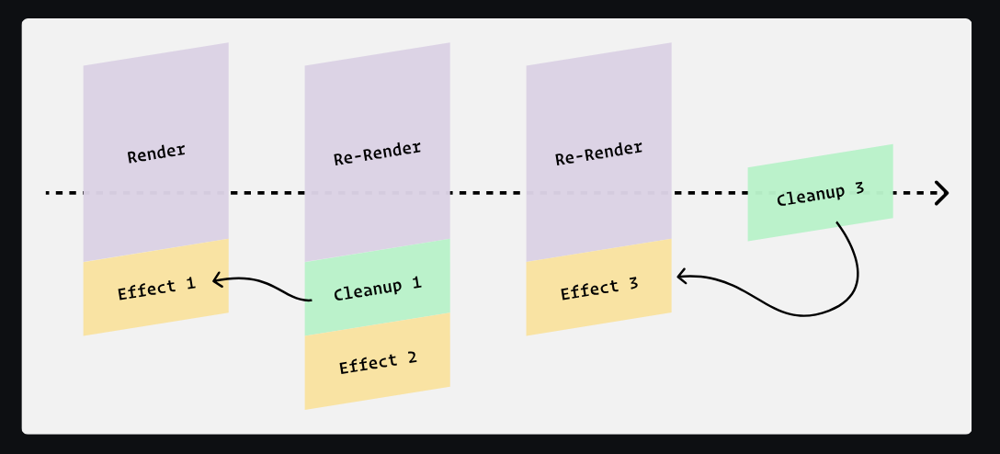

# Chap 6 | Side Effects

## Side Effects

As we build applications, we often need to synchronize with external systems. This can include things like:

- Making network requests
- Managing timeouts / intervals
- Reading/writing from localStorage

- Listening for global events

React calls all of these things “side effects”.

## The useEffect Hook

- Core React loop ➡️ We give React a chunk of JSX and it produces the resulting DOM .When the JSX changes (eg because the state or props change), React will update the DOM to match, always keeping it in sync .This is React's main job , its primary purpose
- Things that fall outside of this main job like updating the document's title , making network requests , interacting with local storage are known as side effects 
- React gives us a specific tool for managing side effects : the useEffect hook .We pass some code to `useEffect` , via a callback function , and React calls that function for us after each render
- **Why not do the work directly in the component?** Well, we *can*, but `useEffect` gives us additional tools.
- We can specify *dependencies* so that the effect only runs sometimes, when a particular value has changed. For example:

```js  
React.useEffect(() => {
  // Effect logic
  document.title = `(${count}) — Counter 2.0`;
}, [count]);
```

- By specifying `[count]`, we're saying that the effect logic should *only* run when the `count` variable changes.
- Effects always run after the very first render, no matter what we specify in our dependency array.

## Effect Lint Rules

Suppose we have the following code:

```jsx
function App() {
  const [count, setCount] = React.useState(0);

  React.useEffect(() => {
    console.log(count);
  }, []);

  return (
    <>
      <p>The count is: {count}</p>
      <button onClick={() => setCount(count + 1)}>
        Increment
      </button>
    </>
  );
}
```

If we try to run this code, we'll get a lint warning from React, telling us we're violating an ESLint rule: `react-hooks/exhaustive-deps`.


To disable the warning(we are not fixing the error) we can do the following : 

```js
React.useEffect(() => {
  console.log(count);
  // eslint-disable-next-line
}, []);
```

This magical incantation will silence the warning, but it doesn't solve the problem!

This rule isn't arbitrary, it's here for a very good reason: if we don't include the `count` state variable in the dependency array, we'll wind up in an *extremely* confusing situation.

Every time we re-render, by calling `setCount`, we take a new snapshot, and create a new `count` variable. This means that there are different "versions" of the `count` variable, one for each snapshot.

By not including `count` in the dependency array, it means that our effect is "frozen in time"; the `console.log(count)` code inside the effect only has access to the *first* `count` variable, the one equal to `0`.

It leads to this bewildering situation, when the state changes:

```jsx
function App() {
  // This `count` is equal to 3:
  const [count, setCount] = React.useState(0);

  React.useEffect(() => {
  // This `count` is equal to 0:
    console.log(count);
  }, []);

  return (
    <>
      {/* this `count` is equal to 3: */}
      <p>The count is: {count}</p>
      <button onClick={() => setCount(count + 1)}>
        Increment
      </button>
    </>
  );
}
```

Our effect has gotten out-of-sync with the rest of the code, and it  means that we're seeing multiple versions of the state at the same time.

To fix it, we need to add `count` to the dependency array:

```jsx
React.useEffect(() => {
  console.log(count);
}, [count]);
```

This means that the effect will re-run whenever we call `setCount`, keeping it in sync as the state changes.

## Running on Mount

Lets explore how we might build an “auto-focusing” text input, one that captures focus when the component mounts.

Suppose we have the following code:

```jsx
function App() {
  const [
    searchTerm,
    setSearchTerm,
  ] = React.useState('');

  return (
    <main>
      <form>
        {/* I want to focus this input on mount: */}
        <input
          value={searchTerm}
          onChange={(event) => {
            setSearchTerm(event.target.value);
          }}
        />
        <button>Search</button>
      </form>
    </main>
  );
}
```

We can capture a *reference* to that input with the `useRef` hook

```jsx
function App() {
  const [
    searchTerm,
    setSearchTerm,
  ] = React.useState('');

  const inputRef = React.useRef();

  
}
```

Input DOM nodes have a `.focus()` method we can call to focus it, but how do I do it on mount?

We can do it right in the render:

```jsx
function App() {
  const [
    searchTerm,
    setSearchTerm,
  ] = React.useState('');

  const inputRef = React.useRef();
  inputRef.current.focus();

  // ✂️
}
```

Unfortunately , this leads to an error


The trouble is that when we first create the `inputRef`, it's empty (`{ current: undefined }`). It only captures the input DOM node *after* the first render.

The solution is to use the `useEffect` hook:

```jsx
function App() {
  const [
    searchTerm,
    setSearchTerm,
  ] = React.useState('');

  const inputRef = React.useRef();

  React.useEffect(() => {
    inputRef.current.focus();
  }, []);

  // ✂️
}
```

Critically, we're passing an *empty dependency array*. This is how we tell React, “this effect doesn't depend on any other values”.  And if it doesn't depend on any values, it'll never re-run!

Effects always run after the first render, and then again whenever the  dependencies change. This structure ensures it'll only run after the  first render.

## The "autofocus" attribute 

HTML form inputs have an `autofocus` property that can be used to automatically focus the element on page load:

```html
<input autofocus type="text" />
```

Given that there's a built-in way to auto-focus an input, why are we going through all the trouble with `useRef` and `useEffect`??

**Unfortunately, it isn't safe to use the `autofocus` attribute in React.**

The `autofocus` attribute only works reliably if the element is present when the page  first loads. It won't work if the element is dynamically injected into  the page afterwards.

And in React, **pretty much every element is dynamically injected!** The only exception is if you use server-side rendering, and even then,  only for the very first page the user visits on your site.

And so, the solution shown above, capturing an input with a ref and triggering `.focus()` in an effect, is the best way to solve this problem in React.

## Subscriptions

Let's suppose we want to track the user's cursor position. Whenever they move their mouse, we'll update some state.

We can add `onMouseMove` event handlers to specific DOM nodes, like this:

```html
<div
  onMouseMove={event => {
    setMousePosition({
      x: event.clientX,
      y: event.clientY,
    });
  }}
>
```

This will only work while the user is hovering over this particular `<div>`, though… What if we want to track their cursor position no matter where the mouse is within the viewport?

In order to listen for global events, we can use `window.addEventListener`. 

Specifically, we'll want to listen for `mousemove` events. We can get the cursor position using `event.clientX` and `event.clientY`.

To listen for global mouse-move events, we need to use `window.addEventListener`. We can register it in an effect hook, like this:

```jsx
React.useEffect(() => {
  function handleMouseMove(event) {
    setMousePosition({
      x: event.clientX,
      y: event.clientY,
    });
  }

  window.addEventListener('mousemove', handleMouseMove);
});
```

At first glance, this *seems* to work, **but there are two problems with this approach.**

First, we aren't ever cleaning up our event listener. 

The issue I want to talk about is that **we're adding multiple event listeners.**

Because we haven't specified a dependency array, this effect will run after  every single render. That means every time the user's mouse position  changes, we call `window.addEventListener` *again*. If 100 mouse-move events fire, we'll have 100 event listeners.

**`window.addEventListener` is a subscription.** We only want to subscribe once, when the component first mounts.

Here's what the proper solution looks like:

```jsx
React.useEffect(() => {
  function handleMouseMove(event) {
    setMousePosition({
      x: event.clientX,
      y: event.clientY,
    });
  }

  window.addEventListener('mousemove', handleMouseMove);
}, []);
```

`window.addEventListener` is not part of React, it's part  of the DOM. When we call this method, we set up a long-running process  that will call our callback function whenever the `mousemove` event is detected.

It's the same story with many other situations, like:

- Running an interval
- Opening a web socket connection
- Using `ResizeObserver`

With an empty dependency array, the effect only runs once, after the first render, starting a single long-running process:


*Without* the empty dependency array, however, our effect runs after every render, starting multiple long-running processes:


Final Code 

```jsx
import React from 'react';

function MouseCoords() {
  const [mousePosition, setMousePosition] = React.useState({
    x: 0,
    y: 0,
  });

  React.useEffect(() => {
    function handleMouseMove(event) {
      setMousePosition({
        x: event.clientX,
        y: event.clientY,
      });
    }
    window.addEventListener('mousemove', handleMouseMove);
  }, []);

  return (
    <div className="wrapper">
      <p>
        {mousePosition.x} / {mousePosition.y}
      </p>
    </div>
  );
}

export default MouseCoords;
```

## Cleanup

We've been learning how to start long-running processes on mount with the `useEffect` hook, but our solutions so far have been incomplete!

To show the problem, we've updated our mouse-tracking example from the Running On Mount” chapter so that it's conditionally rendered:

```jsx
function App() {
  const [isTrackingMouse, setIsTrackingMouse] = React.useState(true);

  function toggleMouseTracking() {
    setIsTrackingMouse(!isTrackingMouse);
  }

  return (
    <div className="wrapper">
      <button onClick={toggleMouseTracking}>
        Toggle Mouse Tracking
      </button>
      {isTrackingMouse && <MouseTracker />}
    </div>
  );
}
```

When `isTrackingMouse` is a truthy value , we mount the component.This creates a component instance , a place for us to store data related to the component

When `isTrackingMouse` is false , however , we unmount the component , destroying the instance and removing all associated DOM nodes

t's intuitive to think, therefore, that any lingering effects will also  be interrupted if the component unmounts, but unfortunately, it doesn't  work this way. 

Our `MouseTracker` component sets up the following effect:

```jsx
React.useEffect(() => {
  function handleMouseMove(event) {
    setMousePosition({
      x: event.clientX,
      y: event.clientY,
    });
  }

  window.addEventListener('mousemove', handleMouseMove);
}, []);
```

When the component unmounts, the event listener remains, tracking the cursor position and calling `setMousePosition` on a component instance that shouldn't exist anymore!

This is a problem for 2 reasons:

1. Every time the component is re-mounted, another event listener will be added, without the previous one being removed.
2. Because we're referencing a part of the component instance (by calling `setMousePosition`), the JavaScript garbage collector isn't able to clean up this instance!  That means that every time we mount this component, we create an  instance that will never be erased.

This is known as a *memory leak.* The longer the person spends  using our application, the more memory it will consume. The memory will  be released if the user refreshes the page, but often people will leave  the same tab running for weeks or months on end!

**Why isn't the event listener removed automatically?** Here's the thing: React actually has no idea what goes on inside our effect function:

```jsx
// What React sees:
React.useEffect(() => {
  ????
}, []);
```

React sees that we've given it a function, and we've specified when  it should be called (with the dependency array), but React can't “see  inside” this function! It has no idea that we've started an event  listener, since the event-listener stuff is part of the DOM.

Similarly, the JavaScript engine that runs our event listener has no idea that it  was created within a component instance, and that it should be  contingent on that instance existing.

Essentially, we have two independent systems here, and it's up to us to synchronize them.

Fortunately, the `useEffect` comes with a tool to make this possible: **cleanup functions.**

Here's what it looks like:

```jsx
React.useEffect(() => {
  function handleMouseMove(event) {
    setMousePosition({
      x: event.clientX,
      y: event.clientY,
    });
  }

  window.addEventListener('mousemove', handleMouseMove);

  return () => {
    window.removeEventListener('mousemove', handleMouseMove);
  }
}, []);
```


Within our effect function, we return a function that contains the  cleanup work to be done. React will hang onto this function, and invoke  it at the appropriate time: right before the component unmounts.

This is typically the pattern for any subscription / long-running process. We *subscribe* in the effect function, and *unsubscribe* in the cleanup function. React will call the cleanup function right  before the component unmounts, stopping the process and ensuring we  don't wind up with a memory leak.

Code with the cleanup function added : 

```jsx
import React from 'react';

function MouseTracker() {
  const [mousePosition, setMousePosition] = React.useState({
    x: 0,
    y: 0,
  });

  React.useEffect(() => {
    // Effect logic:
    function handleMouseMove(event) {
      console.log('move');
      setMousePosition({
        x: event.clientX,
        y: event.clientY,
      });
    }
window.addEventListener('mousemove', handleMouseMove);

    // Cleanup function:
    return () => {
      window.removeEventListener('mousemove', handleMouseMove);
    };
  }, []);

  return (
    <p>
      {mousePosition.x} / {mousePosition.y}
    </p>
  );
}

export default MouseTracker;
```

## Why is the cleanup function set up this way ? 

This is really more of an implementation detail.

That said, there *is* a good reason for it to be set up this way

The reason being our cleanup function needs to access to stuff created in the effect function.

```jsx
React.useEffect(() => {
  function handleMouseMove(event) {
    setMousePosition({
      x: event.clientX,
      y: event.clientY,
    });
  }

  window.addEventListener('mousemove', handleMouseMove);

  return () => {
    // We have access to `handleMouseMove` because it's
    // defined in the parent scope!
    window.removeEventListener('mousemove', handleMouseMove);
  };
}, []);
```

This is the reason the React team went with this approach 

## Cleanup With Dependencies

What if our effect has dependencies ? How do they interact with this cleanup function ? 

In this example everything happens within a component 

```jsx
import React from 'react';

function MouseTracker() {
  const [mousePosition, setMousePosition] = React.useState({
    x: 0,
    y: 0,
  });
  const [isEnabled, setIsEnabled] = React.useState(true);

  React.useEffect(() => {
    function handleMouseMove(event) {
      setMousePosition({
        x: event.clientX,
        y: event.clientY,
      });
    }

    window.addEventListener('mousemove', handleMouseMove);

    return () => {
      window.removeEventListener('mousemove', handleMouseMove);
    };
  }, []);

  function toggleMouseTracking() {
    setIsEnabled(!isEnabled);
  }

  return (
    <>
      <button onClick={toggleMouseTracking}>
        Toggle Mouse Tracking
      </button>
      <p>
        {mousePosition.x} / {mousePosition.y}
      </p>
    </>
  );
}

export default MouseTracker;
```

Essentially we want to register the event listener when `isEnabled` is `true` , and unregister it when the user clicks the button , flipping `isEnabled` to `false`

We could do something like this ➡️

```jsx
if (isEnabled) {
  React.useEffect(() => {
    function handleMouseMove(event) {
      setMousePosition({
        x: event.clientX,
        y: event.clientY,
      });
    }

    window.addEventListener('mousemove', handleMouseMove);

    return () => {
      window.removeEventListener('mousemove', handleMouseMove);
    };
  }, []);
}
```

Essentially we are conditionally calling the `useEffect` hook . Unfortunately, as we've learned, this violates the “Rules of Hooks”. We're not allowed to conditionally call *any* hooks.

What if we move the `if` condition within the hook , like this ? 

```jsx
React.useEffect(() => {
  if (isEnabled) {
    function handleMouseMove(event) {
      setMousePosition({
        x: event.clientX,
        y: event.clientY,
      });
    }

    window.addEventListener('mousemove', handleMouseMove);

    return () => {
      window.removeEventListener('mousemove', handleMouseMove);
    };
  }
}, []);
```

If we run this code, we get a *different* lint warning: we're missing a dependency! Like we saw in the Effect Lint Rules lesson, we need to add all state variables to the dependency array.

When we add `isEnabled` to the dependency array, we solve all of the lint warnings... and we also solve the problem!

```jsx
// ✅ This code does exactly what we want!
React.useEffect(() => {
  if (isEnabled) {
    function handleMouseMove(event) {
      setMousePosition({
        x: event.clientX,
        y: event.clientY,
      });
    }

    window.addEventListener('mousemove', handleMouseMove);

    return () => {
      window.removeEventListener('mousemove', handleMouseMove);
    };
  }
}, [isEnabled]);
```

How exactly does this work , though ?

-  When the component mounts, we run the effect, registering the event  listener, and handing React the cleanup function, like a gift waiting to be opened
- As the user moves the mouse around, the `mousePosition` state will be updated rapid-fire, but the effect doesn't re-run, since `mousePosition` isn't a dependency.
- If the user clicks the button, `isEnabled` flips to false. Since `isEnabled` is a dependency, it means the effect will re-run.
- **First, though, React invokes the cleanup function!**
- The event listener is removed, and because `isEnabled` is `false`, the effect is a no-op.
- This process repeats every time the user clicks the button.

The key trick here is that effects aren't meant to "stack". Before React can re-run the effect, it'll invoke the cached cleanup function, to  make sure we're starting from a "clean slate".

The order of operations :


A view of snapshots and cleanup: 


Cleanup functions aren't always provided:


